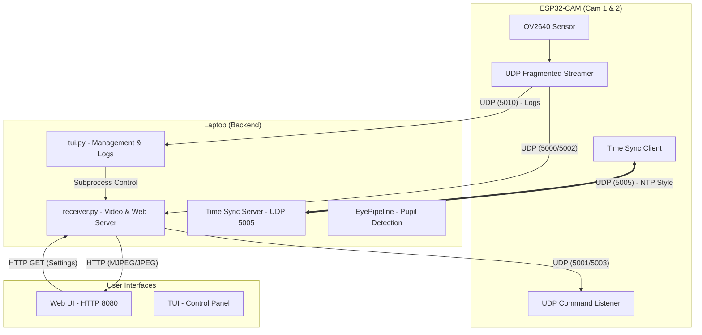

# NETR Project Communication & Data Flow

This document explains the architecture and data flow between the ESP32-CAM rigs, the Python backend/TUI, and the Browser frontend.

## 1. System Architecture Diagram

## 2. Communication Protocols

### A. Video Streaming (UDP 5000 / 5002)
To handle large JPEG frames over UDP, the ESP32 fragments them into chunks.
*   **Packet Header (16 bytes):** `[4B Frame ID] [2B Chunk Index] [2B Total Chunks] [8B Timestamp (µs)]`
*   **Reassembly:** `receiver.py` uses a dictionary-based buffer to collect chunks. Incomplete frames are dropped after 250ms.

### B. Time Synchronization (UDP 5005)
This is critical for calculating latency and sync offset.
1.  **ESP32** sends `SYNC_REQ:<mono_us>`.
2.  **Laptop** records `T2` (receive time), `T3` (send time) and responds with `SYNC_RESP:<mono_us>:<T2>:<T3>`.
3.  **ESP32** calculates the clock offset and adjusts its internal "Global Time".

### C. Hardware Control (UDP 5001 / 5003)
Settings are sent as short ASCII strings to the ESP32 command port.
*   **Format:** `prefix:value` (e.g., `q:12` for quality, `f:30` for FPS).
*   **Execution:** The ESP32 `cmdTask` polls this port every 50ms and applies settings to the OV2640 sensor.

### D. Discovery (UDP 5004)
1.  **Laptop** broadcasts a beacon: `LAPTOP:<IP>:<Timestamp>`.
2.  **ESP32** hears the beacon and sends a response: `CAM:<ID>`.
3.  Both sides now know each other's IPs, enabling the stream.

## 3. Web UI Logic (Visual Sync)
The Browser doesn't use standard `` for both cameras because they would drift. Instead:
1.  JavaScript calls `Promise.all([fetch('/jpeg/1'), fetch('/jpeg/2')])`.
2.  Once **both** blobs are downloaded and converted to Bitmaps, it uses `requestAnimationFrame`.
3.  Both canvases are updated in the **same browser paint cycle**, ensuring zero visual tearing between Cam 1 and Cam 2.

## 4. Recording Flow
1.  `receiver.py` maintains a `collections.deque` (rolling buffer) of the last 30 seconds of JPEG frames in RAM.
2.  When the user clicks **Save**, a background thread:
    *   Estimates the real FPS from the frame timestamps.
    *   Uses `cv2.VideoWriter` to encode an `.avi` file.
    *   Saves the file to the `recordings/` directory for the Player to access.

## 5. Calibration session replay (offline)
After a calibration run, `python scripts/replay_calib_session.py recordings/<timestamp>/` rebuilds `offline_samples.json` and `gaze_model_fitted.json` from raw world video, `eye.jsonl`, fixations in `screen_events.jsonl`, and `marker_screen_positions.json` (saccade mode).
