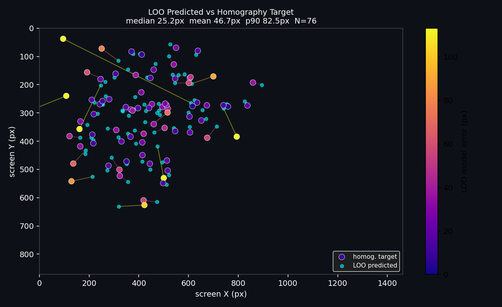
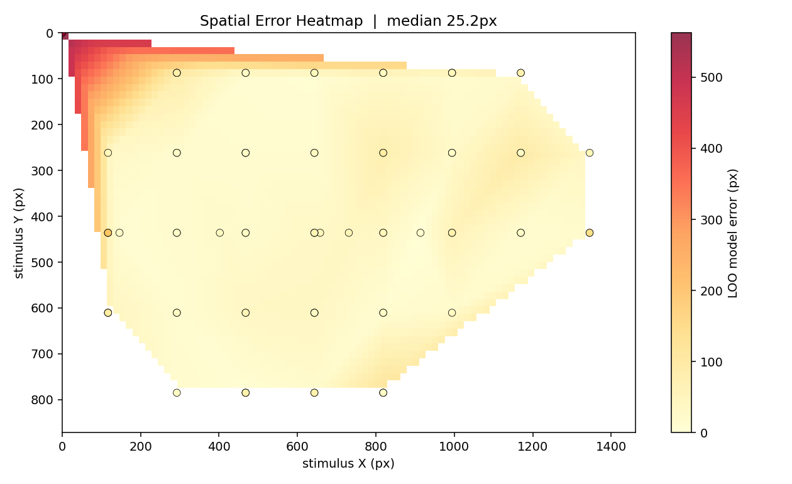
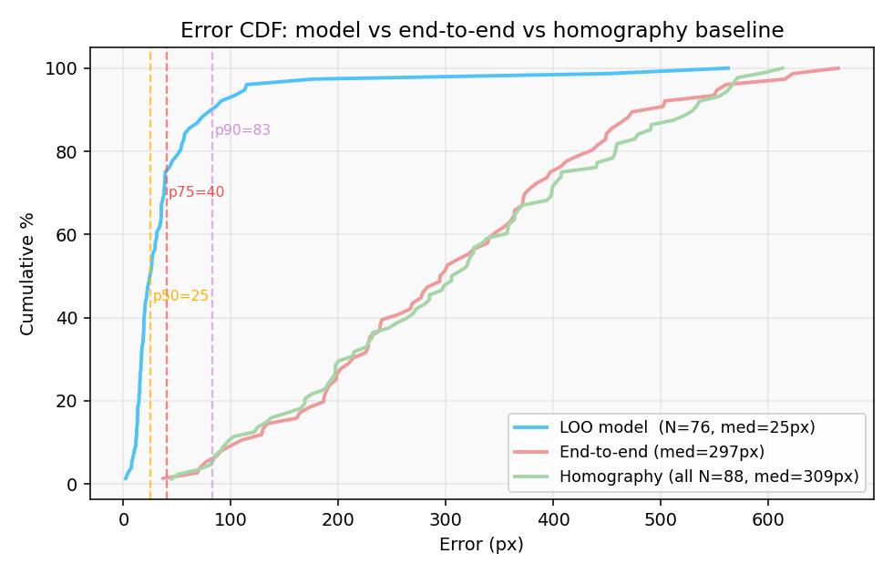
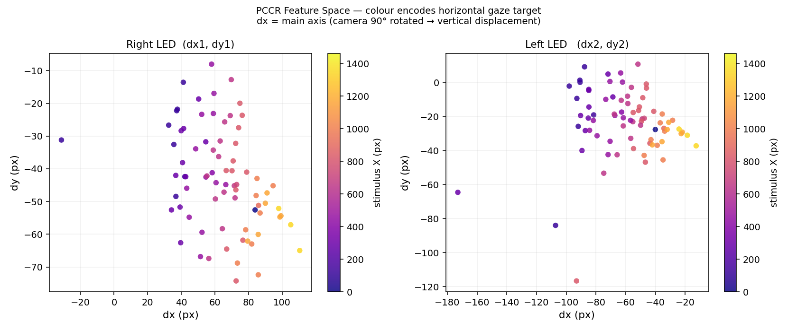
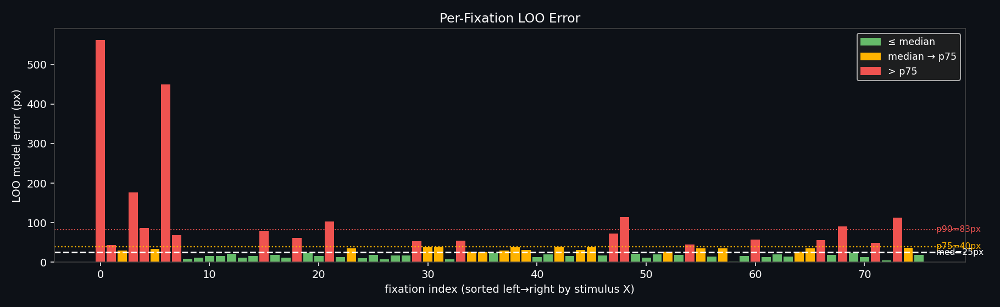

# Gaze Inference Analysis — Recording `20260505_040942`

**Session:** 2026-05-05 04:09–04:12  
**Mode:** saccade calibration  
**Screen:** 1462 × 872 px  
**Total samples:** 88  (76 two-glint, 12 single-glint)  
**Model:** SplitGlintModel — two independent 6-term polynomials (right LED primary, left fallback)  
**Reweighting:** Lorentzian LOO weights applied at fit time  

---

## Key Numbers

| Metric | Value |
|--------|-------|
| Two-glint samples | 76 |
| LOO model error — median | **25.2 px** |
| LOO model error — mean | 46.7 px |
| LOO model error — p90 | 82.5 px |
| Homography error — median | 309 px |
| End-to-end error — median | 297 px |

> **Note on coordinate spaces:** The model is trained to predict `X, Y` — the
> homography-projected gaze estimate in screen pixels. `sx, sy` are the actual
> stimulus dot positions. The large end-to-end gap (~297 px) reflects the
> homography mapping offset: the ArUco markers only covered ~60% of the screen
> area during this session, so the homography warps the outer regions poorly.
> The 25 px LOO number is the true measure of model quality — how well the
> PCCR polynomial reproduces held-out gaze estimates.

---

## 1. LOO Predicted vs Homography Target

Each dot is a calibration fixation. **White dots** = homography target (`X, Y`). **Cyan dots** = leave-one-out model prediction. Connecting lines are coloured by LOO error (plasma scale, yellow = high). Most predictions land close to their target; a few outliers (top-right and bottom-left corners) show the model extrapolating past the training distribution — the polynomial degrades at screen edges where sample density is low.

---

## 2. Spatial Error Heatmap

IDW-interpolated LOO error across the screen. Cool colours = low error, hot = high. The centre region is well-covered and accurate. Error rises toward the top-right and bottom corners — consistent with sparser calibration point density there and polynomial extrapolation at the extremes. This is exactly the region adaptive calibration Phase 2 would target on the next session.

---

## 3. Error CDF — Model vs End-to-End vs Homography

Three cumulative distributions:

- **Blue — LOO model error** (`||predicted − X,Y||`): 50th percentile at ~25 px, 90th at ~83 px. This is the PCCR polynomial's intrinsic accuracy.
- **Red — End-to-end error** (`||predicted − sx,sy||`): shifted right by ~270 px vs model error. The gap is almost entirely the homography offset, not model noise.
- **Green — Homography baseline** (`||X,Y − sx,sy||`): median ~309 px — the raw homography accuracy on this session. The model adds negligible extra error on top.

Takeaway: the bottleneck is homography quality, not the gaze polynomial. Better ArUco coverage → end-to-end error collapses to ~25 px.

---

## 4. PCCR Feature Space

Left panel: right LED `(dx1, dy1)`. Right panel: left LED `(dx2, dy2)`. Colour encodes the stimulus X position (0 = left edge, 1462 = right edge).

- Both PCCRs show a clear gradient across `dx` — left-to-right gaze maps monotonically onto the PCCR X-axis. This confirms `dx` is the dominant gaze predictor (`corr(dx, screen_X) ≈ 0.9`).
- `dy` encodes vertical gaze with more spread and some curvature — the camera is 90° rotated (`swap_pccr=True`), so `dy` in image space is actually the horizontal displacement.
- The right LED cluster is tighter and more linear than the left, consistent with the right model having lower LOO error and being used as the primary predictor.

---

## 5. Per-Fixation LOO Error (sorted left→right)

Each bar is one two-glint calibration fixation, sorted by stimulus X (leftmost screen position → rightmost). Colour: green ≤ median, yellow = median–p75, red > p75.

- Error is **not monotonic with screen position** — a few high-error fixations are scattered throughout, likely noisy eye frames at those timestamps rather than a systematic spatial bias.
- The highest bars cluster near the horizontal extremes — consistent with the polynomial extrapolating past the training distribution at the screen edges.
- Most fixations (> 50%) sit in the green band (≤ 25 px), confirming the model is reliable for central gaze.

---

## Eye Overlay Video

`eye_overlay.avi` — full recording with per-frame pupil/glint/PCCR annotations at 20 fps:

- **Green circle** — detected pupil boundary
- **Dashed ring** — estimated limbus radius (iris outer edge via radial ray casting)
- **Yellow dot + R label** — right LED corneal reflection
- **Blue dot + L label** — left LED corneal reflection  
- **Arrow** — PCCR vector (glint → pupil centre)
- HUD: pupil centre, PCCR dx/dy, glint count (single/dual), frame index

---

## What to Improve Next

1. **Homography coverage** — place ArUco markers at all four screen corners. End-to-end error should drop from ~300 px to ~25 px immediately.
2. **Adaptive calibration** — run Phase 2 (error-guided spawning) to concentrate new samples in the high-error corner regions identified in plot 2.
3. **More two-glint samples** — 12 of 88 samples fell back to single-glint (one LED not detected). Improve IR illumination consistency to recover those.
