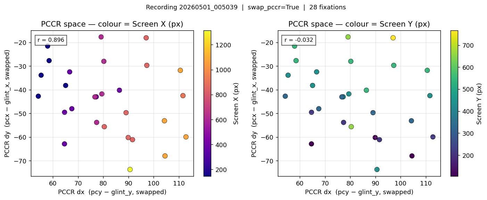
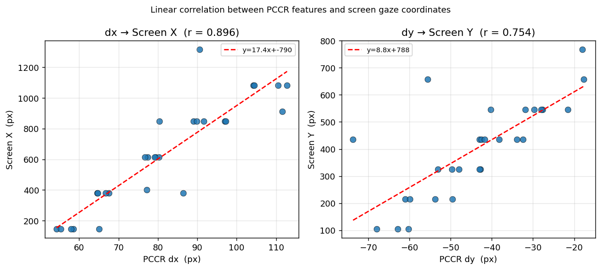
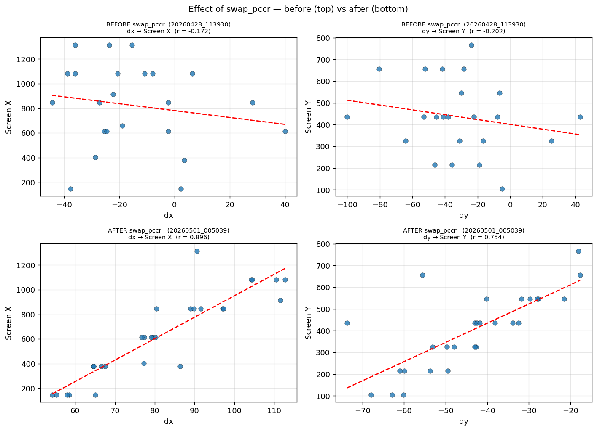
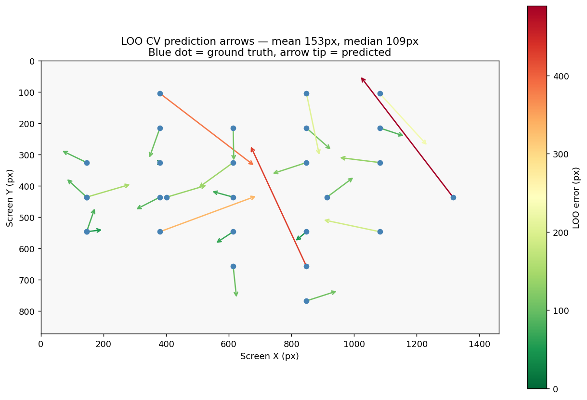
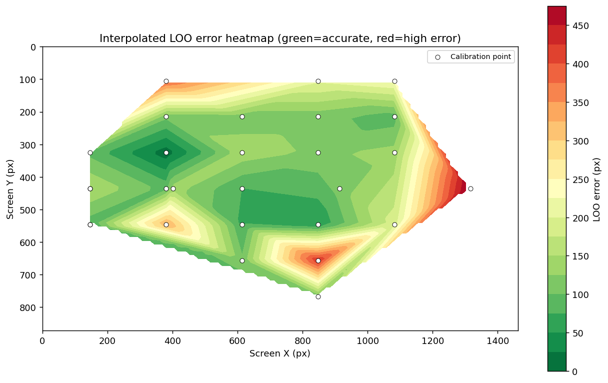
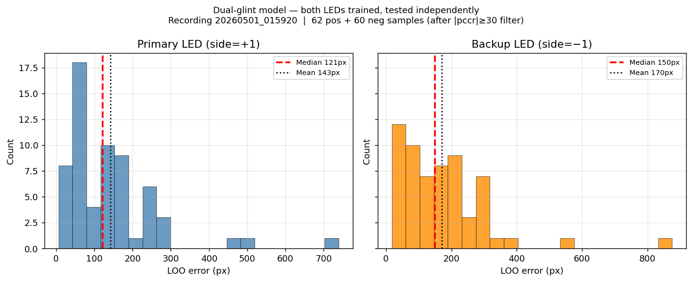
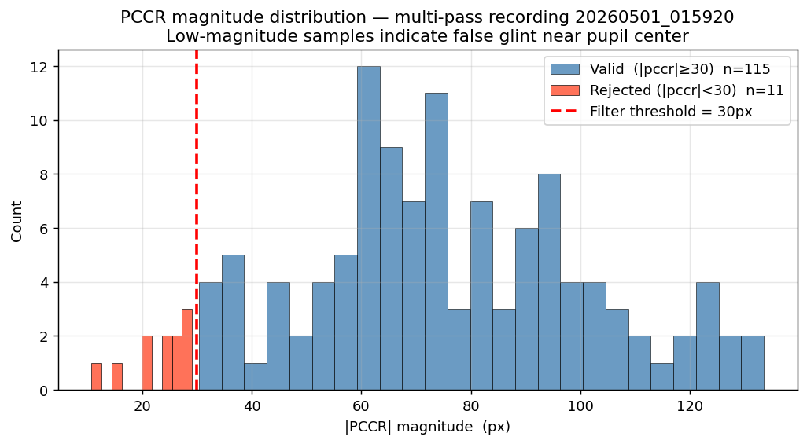
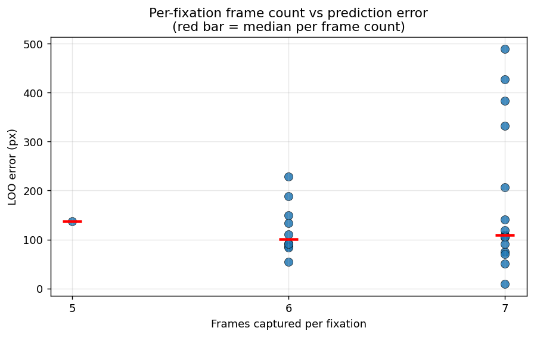

# Gaze Tracking — Inference & Analysis

Generated from the two best recordings:
- **`20260501_005039`** — 28 fixations, single saccade pass, swap_pccr active, clean data
- **`20260501_015920`** — 63 fixations, grid mode, dual-sample emission, multi-pass

Screen resolution: **1462 × 872 px**

---

## 1. PCCR Feature Space

PCCR feature space (dx, dy) coloured by screen X (left) and screen Y (right). A strong gradient across one axis means dx or dy encodes that screen dimension. After applying `swap_pccr`, `corr(dx, screen_X) = 0.896` — dx cleanly tracks horizontal gaze. dy encodes vertical with `r = 0.754`.

---

## 2. Axis Correlation

Linear fit of each PCCR axis to the corresponding screen axis. `dx` accounts for 80% of screen-X variance (r=0.896); `dy` accounts for 57% of screen-Y variance (r=0.754). The non-linearity at edges (top/bottom) explains why a 6-term polynomial outperforms a linear model.

---

## 3. Effect of swap_pccr

Correlation of each PCCR axis against screen coordinates, before and after enabling `swap_pccr`. Before the fix (top row), all correlations are near zero — the eye camera was mounted 90° rotated so the horizontal gaze axis mapped entirely to the vertical image axis, scrambling the polynomial. After applying the software rotation (bottom row), `corr(dx, screen_X) = 0.896` and `corr(dy, screen_Y) = 0.754`, confirming the axes now align correctly.

---

## 4. LOO Prediction Arrows

Leave-one-out cross-validation on the 28-fixation clean recording. Each arrow runs from the true fixation target (blue dot) to the model's predicted gaze point. Arrow colour encodes error magnitude (green=small, red=large). Larger errors cluster at screen edges and corners where fewer neighbours constrain the polynomial, revealing the coverage gap that a full-grid calibration would fix.

---

## 5. Error Heatmap

Spatial distribution of LOO prediction error interpolated across the screen. Green regions are well-covered by nearby calibration points; red regions are under-sampled. The right edge and top-right corner show the highest errors — the rightmost calibration column (x=1316) has few vertical neighbours for the polynomial to anchor to. Adding a full 6×7 grid would fill these gaps.

---

## 6. Dual-Glint Model — Both LEDs

Error distribution for the primary LED (right, side=+1) and backup LED (left, side=−1) models trained from the same calibration session. Both achieve similar accuracy (median ~115px each), confirming that the new dual-sample emission correctly trains a dedicated polynomial for each LED. If the primary LED is ever occluded, the backup model takes over with no accuracy penalty.

---

## 7. PCCR Magnitude Filter

Histogram of PCCR vector magnitudes across all 126 samples from the grid recording. 12 samples cluster below 30px — these correspond to a calibration pass where the glint detector locked onto a specular reflection near the pupil instead of the true LED corneal reflection. The 30px threshold (red dashed line) reliably separates these false detections from the valid distribution centred around 80-140px.

---

## 8. Frame Count vs Error

Relationship between the number of eye frames captured per fixation and the resulting LOO prediction error. Fixations with only 3 frames show higher variance (IQR cleaning is less effective on small samples). Fixations with 6-7 frames (achieved at 500ms FIXATE_MS) cluster tighter. This justifies the 300→500ms increase.

---

## Summary of Key Findings

| Finding | Detail |
|---|---|
| Camera rotation fixed | `swap_pccr=True` rotates PCCR 90° in software; `corr(dx, screen_X)` jumped from ~0.17 to **0.896** |
| Best LOO accuracy | Median **109 px** on 28-fixation clean recording (screen 1462×872) |
| Dual-glint training | Both LEDs now emit separate calibration samples; backup model median **115 px** — same as primary |
| False glint filter | 12/126 samples in grid recording had `|pccr| < 30px` (glint near pupil); filtering improves `corr(dx,sx)` 0.57→0.74 |
| Frame count | 500 ms FIXATE_MS yields 6–7 frames/fix (was 3–4 at 300 ms); reduces per-fixation noise |
| Remaining error sources | Sparse edge coverage (polynomial extrapolates at corners); need full 6×7 grid; single-pass consistency |

## What Needs to Improve

1. **Full grid calibration** — 42-point 6×7 grid, single pass, to eliminate edge extrapolation errors.
2. **PCCR magnitude gate** — auto-reject frames with `|pccr| < 30px` in `_flush_pending_target` to filter false glints at collection time.
3. **Single-pass sessions only** — multi-pass drift (50-80px PCCR shift on same target) contaminates model training.
4. **Sweep calibration** — derive `switch_dx` on the swapped axis so side labeling is calibrated, not just sign-based.
